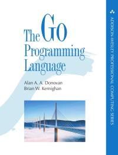

# 关于中文版

作为 [Go圣经](http://golang-china.github.io/gopl-zh) [《The Go Programming Language》](http://gopl.io/) (中文名[《Go编程语言》](http://golang-china.github.io/gopl-zh)) 英文原版纸质图书的购买者, 这是我们的一个中文版 **读书笔记**, 仅供学习交流用.

- 此中文版 **读书笔记** 在线预览: http://golang-china.github.io/gopl-zh
- 此中文版 **读书笔记** 的源文件: http://github.com/golang-china/gopl-zh
- 此中文版 **读书笔记** 项目进度: http://github.com/golang-china/gopl-zh/blob/master/progress.md
- 原版官网: http://gopl.io

授权方式 <a rel="license" href="http://creativecommons.org/licenses/by-nc-sa/4.0/">Creative Commons Attribution-NonCommercial-ShareAlike 4.0 International License</a>. 

欢迎大家提供建议!

# 前言

*“Go是一个开源的编程语言，它很容易构建简单、可靠和高效的软件。”（摘自Go语言官网：http://golang.org）*

Go语言有Google的Robert Griesemer, Rob Pike, 和 Ken Thompson于2007年9月发起,
然后在2009年的11月对外正式发布. 语言及其配套的工具的目标是具有表达力,
高效的编译和执行, 有效地编写高效和健壮的程序.

Go有着和C类似的外表, 和C一样是专业程序员的工具, 用最小的代价获得最大的效果.
但是它不仅仅是一个更新的C. 它还从其他语言借鉴了很多好的想法, 同时避免了过度的复杂性.
Go中和并发相关的特性是新的也是有效的, 同时对数据抽象和面向对象的支持也很灵活.
同时还集成了自动垃圾收集用于管理内存.

Go尤其适合编写网络服务相关基础设施, 也适合开发一些工具和系统软件.
但是Go确实是一个通用的编程语言, 它也可以用在图形图像驱动, 移动应用程序,
和机器学习等领域.它已经成为受欢迎的作为无类似脚本语言的替代者:
因为Go编写的程序通常比脚本语言运行的更快更安全, 很少会发生意外的类型错误.

Go是一个开源的项目, 因此可以免费获编译器/库/配套工具的源码.
它的贡献者来自一个活跃的全球社区. Go可以运行在类UNIX系统上,
比如Linux, FreeBSD, OpenBSD, Mac OSX, Plan9, 还有 Microsoft Windows.
编写的程序无需修改就可以运行在这些环境.

本书是为了帮助你开始已有效的方式使用Go, 充分利用语言的特性和标准库去编写清晰地道的Go程序.

